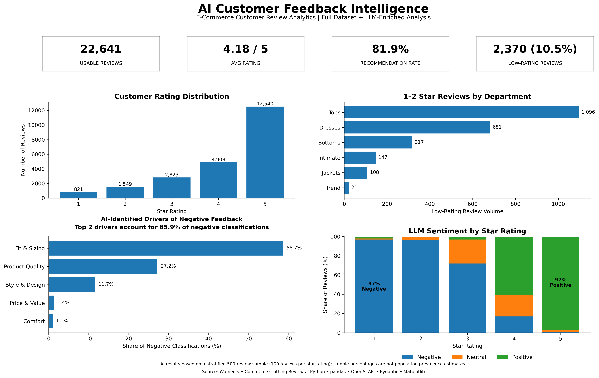

# AI Customer Feedback Intelligence

An end-to-end AI analytics project that transforms unstructured e-commerce customer reviews into structured, decision-ready customer intelligence using Python, the OpenAI API, Pydantic Structured Outputs, and business analytics.

The project combines full-dataset descriptive analysis with LLM-based review classification to identify customer sentiment, product issues, customer intent, urgency, and recommended business actions.



> **Project status: Completed.** The analysis covers **22,641 usable customer reviews** and an LLM-enriched **stratified sample of 500 reviews**. All 500 sampled reviews were successfully converted into structured records, with no duplicate sample indices or missing AI classification fields.

---

## Business Problem

Customer reviews contain valuable information about product quality, fit, design, satisfaction, and purchase intent, but much of this information exists as unstructured text.

Star ratings can indicate whether a customer was satisfied, but they do not directly explain:

- what caused the experience,
- what type of product issue occurred,
- whether the customer is complaining, praising, recommending, or considering a return,
- how urgent the issue may be,
- or what business action could address it.

Manually reviewing thousands of comments is also difficult to scale.

This project asks:

> **How can a retailer transform unstructured customer reviews into structured customer intelligence for faster issue identification and business decision-making?**

The solution combines conventional customer analytics with structured LLM classification, validation, and executive reporting.

---

## Project Workflow

```text
Raw Customer Reviews
        ↓
Data Quality Audit
        ↓
Data Cleaning
        ↓
Full-Dataset Baseline Analytics
        ↓
Stratified 500-Review Sample
        ↓
OpenAI API Classification
        ↓
Pydantic Structured Outputs
        ↓
Checkpoint & Recovery Pipeline
        ↓
Data Integrity & Sanity Checks
        ↓
Customer Issue & Intent Analysis
        ↓
Executive Dashboard
        ↓
Business Recommendations
```

---

## Dataset

**Source:** Women's E-Commerce Clothing Reviews dataset from Kaggle.

The original dataset contains **23,486 customer reviews** and 11 fields, including:

- Review Text
- Rating
- Recommended IND
- Age
- Clothing ID
- Division
- Department
- Product Class
- Positive Feedback Count

### Data Quality Audit

| Metric | Result |
|---|---:|
| Raw records | 23,486 |
| Usable text reviews | 22,641 |
| Missing review text | 845 |
| Duplicate rows | 0 |
| Average rating | 4.18 / 5 |
| Recommendation rate | 81.9% |
| 1–2 star reviews | 2,370 |
| Low-rating rate | 10.5% |

Rows without usable `Review Text` were excluded from text analysis. Original star ratings and recommendation indicators were preserved for downstream validation.

---

## Full-Dataset Customer Analytics

Before introducing an LLM, the project establishes a conventional analytical baseline using all **22,641 usable reviews**.

### Rating Distribution

| Rating | Reviews |
|---:|---:|
| 1 star | 821 |
| 2 stars | 1,549 |
| 3 stars | 2,823 |
| 4 stars | 4,908 |
| 5 stars | 12,540 |

The dataset is strongly skewed toward positive customer experiences, with 5-star reviews representing the largest rating group.

This imbalance is important because a simple random sample would disproportionately represent positive feedback and provide less information about customer problems.

### Department-Level Feedback

| Department | Reviews | Average Rating | 1–2 Star Reviews |
|---|---:|---:|---:|
| Tops | 10,048 | 4.16 | 1,096 |
| Dresses | 6,145 | 4.14 | 681 |
| Bottoms | 3,662 | 4.28 | 317 |
| Intimate | 1,653 | 4.27 | 147 |
| Jackets | 1,002 | 4.25 | 108 |
| Trend | 118 | 3.84 | 21 |

Although **Trend** has the lowest average rating, it contains only 118 usable reviews.

In absolute customer-problem volume, **Tops and Dresses are much more important**, contributing 1,096 and 681 low-rated reviews respectively.

This distinction demonstrates why both **rate-based and volume-based metrics** are needed when prioritizing business problems.

---

## Why Add an LLM Layer?

Traditional metrics answer questions such as:

> How many customers gave a low rating?

The LLM layer helps answer a different question:

> What are those customers actually talking about?

Each review is transformed from unstructured text into standardized analytical dimensions that can be aggregated in pandas and incorporated into reporting workflows.

---

## LLM Sampling Strategy

Because the full dataset is heavily concentrated in 4- and 5-star reviews, the LLM analysis uses a **stratified 500-review sample**:

| Rating | Sampled Reviews |
|---:|---:|
| 1 star | 100 |
| 2 stars | 100 |
| 3 stars | 100 |
| 4 stars | 100 |
| 5 stars | 100 |
| **Total** | **500** |

Sampling uses a fixed random seed for reproducibility.

This design intentionally gives low-rated reviews greater analytical representation, allowing customer problems to be investigated in greater detail.

### Methodological Limitation

The 500-review sample is **not representative of the population rating distribution**.

Therefore:

> **Percentages derived from the AI-enriched sample are interpreted as patterns within the stratified sample, not population prevalence estimates.**

Overall customer metrics are calculated from the full dataset. LLM-derived issue and sentiment patterns are reported separately.

---

## Structured AI Classification

Each sampled review is submitted to the OpenAI API and converted into a validated Pydantic object.

The structured schema contains five business dimensions.

### Sentiment

```text
Positive
Neutral
Negative
```

### Issue Category

```text
Fit & Sizing
Product Quality
Style & Design
Comfort
Price & Value
Other
```

### Customer Intent

```text
Praise
Complaint
Return
Recommendation
General Feedback
```

### Urgency

```text
Low
Medium
High
```

### Recommended Action

The model also produces a short, business-oriented recommended action based on the individual review.

Example:

```json
{
  "sentiment": "Negative",
  "issue_category": "Style & Design",
  "intent": "Recommendation",
  "urgency": "Low",
  "recommended_action": "Re-evaluate side-panel placement and test the design across different body types."
}
```

---

## Why Structured Outputs?

Unrestricted LLM responses can describe the same concept using inconsistent terminology:

```text
Sizing
Size Problem
Fit Issue
Poor Fit
```

The project instead uses **Pydantic and constrained categorical fields**, requiring all of these concepts to conform to:

```text
Fit & Sizing
```

This converts generative AI output into standardized records that can be analyzed using the same pandas operations used for conventional tabular data.

---

## Fault-Tolerant API Pipeline

The 500-review enrichment stage is implemented as a recoverable batch-processing workflow rather than a single API loop.

The pipeline includes:

- OpenAI API processing,
- Pydantic structured validation,
- token-usage tracking,
- periodic checkpoint persistence,
- exception handling,
- API rate-limit handling,
- completed-review tracking,
- and restart-safe processing.

During processing, an API request-per-day rate limit interrupted the initial batch after partial completion.

Instead of restarting the entire analysis, the pipeline loaded the saved checkpoint, identified previously completed `sample_index` values, skipped them, and resumed only the remaining reviews.

The final batch successfully produced:

| Integrity Check | Result |
|---|---:|
| AI-classified reviews | 500 |
| Unique sample indices | 500 |
| Duplicate sample indices | 0 |
| Missing sentiment | 0 |
| Missing issue category | 0 |
| Missing intent | 0 |
| Missing urgency | 0 |
| Missing recommended action | 0 |

This recovery mechanism avoids unnecessary duplicate API calls and makes the enrichment workflow resilient to temporary interruptions.

---

## AI Classification Results

Across the **500-review stratified sample**, the model generated the following structured classifications.

### Sentiment

| Sentiment | Reviews |
|---|---:|
| Negative | 283 |
| Positive | 163 |
| Neutral | 54 |

These counts should not be interpreted as the overall sentiment distribution of the full customer population because the sample intentionally contains equal numbers of reviews from each star rating.

### Issue Categories

| Issue Category | Reviews |
|---|---:|
| Fit & Sizing | 281 |
| Product Quality | 109 |
| Style & Design | 90 |
| Comfort | 13 |
| Price & Value | 7 |

**Fit & Sizing** is the dominant issue theme in the stratified AI sample.

### Customer Intent

| Intent | Reviews |
|---|---:|
| Complaint | 207 |
| Praise | 156 |
| Return | 113 |
| General Feedback | 16 |
| Recommendation | 8 |

### Urgency

| Urgency | Reviews |
|---|---:|
| Medium | 310 |
| Low | 188 |
| High | 2 |

Only two reviews were classified as high urgency, while most feedback fell into the medium- or low-urgency categories.

---

## Validation & Quality Assurance

LLM output was evaluated using data-integrity checks and external behavioral signals already available in the source dataset.

These checks are treated as **sanity checks rather than ground-truth model accuracy measurements**.

### Sentiment vs. Star Rating

| Rating | Negative | Neutral | Positive |
|---:|---:|---:|---:|
| 1 star | 97 | 1 | 2 |
| 2 stars | 96 | 4 | 0 |
| 3 stars | 72 | 25 | 3 |
| 4 stars | 17 | 22 | 61 |
| 5 stars | 1 | 2 | 97 |

The classifications show a strong directional relationship with customer ratings:

- **97% of sampled 1-star reviews** were classified as negative.
- **97% of sampled 5-star reviews** were classified as positive.
- 3-star reviews were substantially more mixed, showing that the classifier was not simply converting rating values into sentiment labels.

### Sentiment vs. Recommendation Behavior

Among sampled reviews where `Recommended IND = 0`:

- **93.8%** were classified as negative,
- 5.8% as neutral,
- and 0.4% as positive.

Among reviews where `Recommended IND = 1`:

- 66.9% were positive,
- 16.1% neutral,
- and 16.9% negative.

The relationship provides an additional external consistency check while also showing that recommendation behavior and textual sentiment are not identical constructs.

---

## Customer Issue Analysis

The structured AI output enables customer problems to be analyzed by both frequency and sentiment.

### Negative Feedback Drivers

Among the **283 reviews classified as negative**:

| Issue Category | Negative Reviews | Share of Negative Reviews |
|---|---:|---:|
| Fit & Sizing | 166 | 58.7% |
| Product Quality | 77 | 27.2% |
| Style & Design | 33 | 11.7% |
| Price & Value | 4 | 1.4% |
| Comfort | 3 | 1.1% |

The two largest drivers are:

> **Fit & Sizing + Product Quality = 85.9% of negative classifications in the stratified sample.**

This provides a more actionable diagnosis than star ratings alone.

### Issue-Level Negative Rates

| Issue Category | Negative Rate |
|---|---:|
| Product Quality | 70.6% |
| Fit & Sizing | 59.1% |
| Price & Value | 57.1% |
| Style & Design | 36.7% |
| Comfort | 23.1% |

Product Quality appears less frequently than Fit & Sizing but has the **highest negative share among its classified reviews**, making it another important issue for investigation.

---

## Return-Intent Analysis

The LLM identified **113 reviews with Return intent**.

Return-related feedback is concentrated primarily in:

- Fit & Sizing
- Product Quality
- Style & Design

Within the structured sample:

- Fit & Sizing accounts for **64** return-intent reviews.
- Product Quality accounts for **31**.
- Style & Design accounts for **15**.
- Price & Value accounts for **3**.

This suggests that fit and product-quality problems are not only associated with negative sentiment but are also strongly represented among reviews expressing return behavior.

---

## Business Insights

The combined full-dataset and LLM analyses suggest three main priorities.

### 1. Prioritize Fit & Sizing

Fit & Sizing represents:

- **281 of 500** AI-classified reviews,
- **166 of 283 negative classifications**, and
- **64 of 113 return-intent classifications**.

A retailer could investigate:

- product-level sizing consistency,
- measurement guidance,
- fit descriptions,
- size-chart accuracy,
- and recurring fit complaints by product category.

### 2. Treat Product Quality as a High-Severity Driver

Product Quality accounts for **27.2% of negative classifications** and has a **70.6% negative rate** within its issue category.

Potential follow-up analysis could identify products or classes repeatedly associated with:

- material concerns,
- construction problems,
- defects,
- or durability complaints.

### 3. Prioritize High-Volume Departments

The full dataset shows that **Tops and Dresses account for the largest absolute volumes of 1–2 star reviews**.

Combining this volume signal with the LLM-derived issue taxonomy provides a practical prioritization framework:

```text
High customer volume
        +
Negative feedback volume
        +
AI-identified issue type
        +
Return intent
        ↓
Business investigation priority
```

---

## Executive Dashboard

The final dashboard combines conventional customer KPIs with LLM-derived customer intelligence.

It includes:

- **22,641** usable customer reviews,
- **4.18 / 5** average rating,
- **81.9%** recommendation rate,
- **2,370 (10.5%)** low-rating reviews,
- full-dataset rating distribution,
- low-rating volume by department,
- AI-identified negative-feedback drivers,
- and LLM sentiment patterns by star rating.

The dashboard deliberately separates **full-dataset metrics** from **LLM sample findings** to avoid presenting stratified-sample percentages as population estimates.

---

## Technology Stack

### Data Analysis
- Python
- pandas
- NumPy
- Jupyter Notebook

### AI / NLP
- OpenAI API
- GPT-5 mini
- Structured Outputs
- Pydantic

### Visualization
- Matplotlib

### Engineering
- Structured categorical schemas
- API token tracking
- exception handling
- checkpoint persistence
- rate-limit recovery
- restart-safe batch processing
- Git / GitHub

---

## Repository Structure

```text
ai-customer-feedback-intelligence/
│
├── README.md
├── ai_customer_feedback_intelligence.ipynb
├── customer_feedback_dashboard.png
└── ai_feedback_enriched_sample.csv
```

The GitHub-ready enriched sample contains **500 rows × 9 fields**:

```text
sample_index
rating
recommended_ind
department
sentiment
issue_category
intent
urgency
recommended_action
```

One missing source department value is explicitly labeled `Unknown` rather than dropping the associated review.

The original review text is not redistributed in the enriched GitHub dataset.

> The original Kaggle dataset is not redistributed in this repository. Refer to the source dataset for access.

---

## Project Outcomes

- [x] Audited 23,486 raw customer-review records
- [x] Prepared 22,641 usable text reviews
- [x] Built full-dataset customer KPI analysis
- [x] Constructed reproducible 500-review stratified sample
- [x] Designed structured customer-feedback taxonomy
- [x] Integrated OpenAI API classification
- [x] Enforced structured outputs with Pydantic
- [x] Built checkpoint and API-recovery workflow
- [x] Successfully classified all 500 sampled reviews
- [x] Verified 500 unique records with no missing AI fields
- [x] Compared AI sentiment with ratings and recommendation behavior
- [x] Identified major negative-feedback and return-intent drivers
- [x] Built executive analytics dashboard
- [x] Produced business recommendations

---

## Analytical Principles & Limitations

This project intentionally distinguishes between four types of evidence:

1. **Full-dataset descriptive evidence** — used for overall customer KPIs and department-level analysis.
2. **LLM-derived patterns** — based on the stratified 500-review sample and not treated as population prevalence estimates.
3. **Validation proxies** — ratings and recommendation behavior provide external consistency checks but are not ground-truth sentiment labels.
4. **Business interpretation** — findings identify patterns and prioritization opportunities rather than causal effects.

The classification taxonomy also assigns a single primary issue category to each review. Reviews containing multiple simultaneous issues may therefore be simplified into their dominant theme.

The project demonstrates how generative AI can be integrated into a conventional analytics workflow while maintaining structured outputs, reproducibility, validation, and transparent methodological boundaries.

---

## Author

**Zihan Liu**  
University of Toronto  
Economics & Mathematics | Statistics
